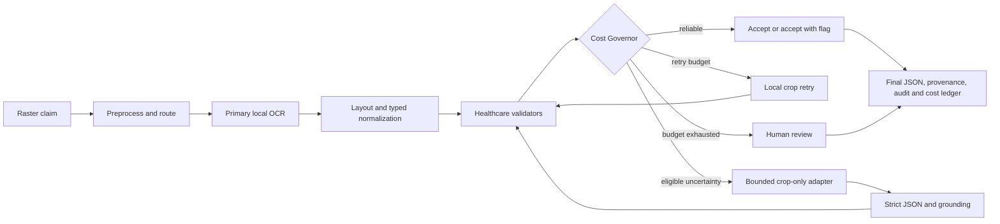

# ClaimRoute AI — final hackathon submission package

Submission baseline: `integrate/final-submission` at release commit
`4dc945617b6789e33cca6dcfaccb3af32e53153a`, tagged `hackathon-final-rc1`.
Application code and frozen evidence are unchanged by this package.

## 1. Executive summary

ClaimRoute AI is a cost-governed healthcare claims extraction prototype. Instead of sending every
page to an expensive multimodal model, it processes each field through the cheapest reliable route:
local preprocessing, document routing, OCR, layout mapping, typed normalization, healthcare
validation, and a Cost Governor. The governor accepts reliable results, permits an explainable
`ACCEPT_WITH_FLAG` state where policy allows, retries uncertain fields with local OCR, selectively
escalates only bounded field crops, and sends unresolved exceptions to human review.

On a frozen 90-page synthetic benchmark, Balanced mode measured 99.716% exact field accuracy and
99.936% critical-field accuracy. It resolved 93.303% of routed fields at the primary local rung and
routed 1.905% to a deterministic offline-oracle escalation simulation. Local usage measured and
prices to $0.0000722/page at the configured compute rate; external calls and measured external spend
were zero. Selective API-equivalent cost is projected at $0.0000227/page, for a projected automated
total of $0.0000949/page. These are synthetic and projected results where labeled, not real-provider
or production claims.

Separate official evidence remains distinct: Tier B selected 4/4 claim pages and rejected 15/15
attachments. The one-time Tier C UB-04 holdout measured 36/42 primary normalized fields (85.714%),
36/63 extended fields (57.143%), 16/18 critical normalized fields (88.889%), and 3/3 registrations
under a provisional denominator policy. It made zero external calls.

## 2. Problem statement

Claims extraction systems face two coupled risks: poor data quality can create unsafe output, while
calling a high-cost model on every page spends money and expands the data boundary even when local
OCR is already reliable. A usable system must decide not only what a field says, but whether the
current evidence is sufficient, whether a cheaper retry can resolve it, and whether any external
call is justified.

## 3. Product overview

ClaimRoute makes that decision per field:

```text
Document
  -> preprocessing
  -> document routing
  -> local OCR
  -> layout mapping
  -> typed normalization
  -> healthcare validation
  -> Cost Governor
  -> local retry
  -> selective crop-level multimodal escalation
  -> final validation
  -> structured JSON + provenance + cost ledger
```

The central question is: **Does this field deserve an AI call at all?**

## 4. Architecture explanation



The implemented prototype is a page-oriented Python pipeline with shared typed models, YAML field
and pipeline policies, provider-independent vision adapters, append-only evaluation receipts, and a
Streamlit interface that invokes the same extraction spine as tests and evaluation.

## 5. Cost Governor

The governor evaluates fused confidence, validator verdicts, field criticality/policy, and attempt
history. Its automated states are `ACCEPT`, `ACCEPT_WITH_FLAG`, `RETRY`, `ESCALATE`, and
`HUMAN_REVIEW`; `ACCEPT_WITH_OVERRIDE` is reserved for an authenticated human correction path and
cannot be produced automatically.

- Reliable candidates finish locally.
- A policy-eligible middle band may finish as `ACCEPT_WITH_FLAG`, preserving the warning.
- Uncertain candidates use one local retry before a paid route where policy permits.
- Only approved fields/providers may cross the external boundary.
- Attempts are budgeted; exhaustion routes to human review.
- Every retry or multimodal candidate is normalized, validated, and sent through the governor again.

Economy, Balanced, and Strict Accuracy are calibrated policy choices, not three separate pipelines.
Balanced is the judged-demo default.

The UI's accuracy-cost frontier is **SYNTHETIC replay-calibration evidence**, not the frozen test
result or live-provider performance:

| Replay mode | Field accuracy | Escalation | Human review | Automated cost/page |
|---|---:|---:|---:|---:|
| Economy | 96.555% | 3.957% | 3.305% | $0.000200 **PROJECTED** |
| Balanced | 98.510% | 7.495% | 0.978% | $0.000240 **PROJECTED** |
| Strict Accuracy | 98.790% | 17.225% | 4.330% | $0.000351 **PROJECTED** |

These points replay recorded Day 8 candidates. They did not rerun OCR or call an external API, and
they do not replace the locked v1.2 runtime presets or the frozen Day 11 benchmark.

## 6. Technical design

| Concern | Implemented design |
|---|---|
| Input | Raster image ingestion; UI accepts PNG, JPEG, or single-page TIFF up to 10 MB |
| Routing | Heuristic CMS-1500, UB-04, custom, unstructured, or unknown classification |
| Extraction | Primary local RapidOCR with template/anchor layout mapping |
| Normalization | Field-aware typed normalization for names, identifiers, dates, codes, and amounts |
| Validation | NPI checksum, CPT/ICD rules, dates, arithmetic, formats, and cross-field checks |
| Retry | Crop-level Tesseract retry with form-ink dropout, then revalidation |
| Multimodal | Offline oracle plus OpenAI/Gemini adapters behind the same field-crop boundary |
| Safety | Crop-size enforcement, approved-provider policy, strict JSON, grounding, response SHA-256 |
| Output | Final structured JSON and detailed audit JSON with field provenance and cost basis |
| Evidence | Resumable JSONL evaluation and measured/projected ledger separation |

Multimodal integration is disabled by default for real providers. API keys are read from environment
variables. Full-page requests are rejected. Raw provider responses are not retained; only SHA-256
evidence and usage/cost metadata are supported. No real-provider smoke test was completed.

## 7. Benchmark methodology

The authoritative synthetic benchmark uses deterministic CMS-1500 and UB-04 data generated with
seed 42. Its frozen test split contains 30 documents rendered at clean, noisy, and ugly quality:
90 pages, 3,168 evaluated fields, and 3,255 routed fields. The 20-document calibration split has
zero overlap with the test split.

Field accuracy is normalized exact match. Critical accuracy uses frozen field-policy criticality.
Routing rates use routed fields. Truly absent optional fields are excluded unless the engine
hallucinates a value. The first page remains in latency statistics. Frozen configuration hashes,
environment metadata, page receipts, field rows, and ledgers are committed under `eval/frozen/`.

## 8. Synthetic benchmark results

All accuracy and routing values below are **MEASURED, SYNTHETIC**. Escalation behavior uses an
**OFFLINE_ORACLE** test double; it is not real-provider performance.

| Metric | Frozen Balanced result |
|---|---:|
| Pages / evaluated fields / routed fields | 90 / 3,168 / 3,255 |
| Exact field accuracy | 99.716% |
| Critical-field accuracy | 99.936% |
| Primary local resolution | 93.303% |
| Local retry routing | 6.697% |
| Local retry resolution | 71.560% |
| Offline-oracle escalation routing | 1.905% |
| Offline-oracle resolution contribution | 4.839% |
| Human review | 1.813% |
| Automated exact match | 98.043% |
| Accept with flag | 10.353% |

## 9. Official dataset evidence

Official evidence is reported separately and never blended with the synthetic benchmark.

| Evidence | Result | Boundary |
|---|---:|---|
| Tier B claim-page selection | 4/4 | **MEASURED, OFFICIAL**; deterministic linked evaluable items |
| Tier B attachment rejection | 15/15 | **MEASURED, OFFICIAL**; ambiguous item excluded |
| Tier C primary normalized accuracy | 36/42 (85.714%) | **MEASURED, OFFICIAL**; provisional denominator |
| Tier C extended coverage | 36/63 (57.143%) | **MEASURED, OFFICIAL**; nonblank expected fields |
| Tier C critical normalized accuracy | 16/18 (88.889%) | **MEASURED, OFFICIAL**; provisional denominator |
| Tier C registration | 3/3 | **MEASURED, OFFICIAL** |
| Tier C external calls / spend | 0 / $0 | **MEASURED, OFFICIAL** |

Tier A has development evidence but is not officially holdout-proven. Tier D routing exists, but
full extraction support and an organiser-confirmed denominator do not.

## 10. Cost model

| Component | USD/page | Evidence label |
|---|---:|---|
| Local preprocessing, OCR, validation, routing, retry | $0.0000722 | **MEASURED** usage at **ASSUMED** $0.05/vCPU-hour |
| External API invoice | $0.0000000 | **MEASURED**; zero calls |
| Selective API equivalent | $0.0000227 | **PROJECTED, OFFLINE_ORACLE** token estimate |
| Total automated processing | $0.0000949 | **PROJECTED** local plus API equivalent |
| Correctly resolved escalated field | $0.00068095 | **PROJECTED, OFFLINE_ORACLE** |
| Human review | $0.03/reviewed field | **ASSUMED**; reported separately |

| Volume | Local compute | Selective API | Automated total | Human review assumption |
|---:|---:|---:|---:|---:|
| 1 million pages | $72.20 | $22.70 | $94.90 | $19,666.67 |
| 10 million pages | $722 | $227 | $949 | $196,666.67 |

Volume figures are linear projections, not invoices or capacity guarantees. They exclude storage,
orchestration, redundancy, observability, networking, support, taxes, and provider latency.

## 11. Throughput and latency

The development-workstation prototype processed 90 synthetic pages in 586.931 seconds:

| Metric | **MEASURED, SYNTHETIC prototype** |
|---|---:|
| Throughput | 9.200 pages/minute (552.024/hour) |
| Mean latency | 6.521 seconds/page |
| P50 latency | 5.269 seconds |
| P95 latency | 10.825 seconds |

This is not a production SLA. Memory and real-provider latency were not measured.

## 12. Security and PHI controls

- Frozen synthetic evidence contains no PHI by construction.
- Official source material stayed local and read-only; committed official reports are PHI-safe.
- Public uploads require synthetic-data attestation and cannot call an external provider.
- Screenshot-safe mode hides document pixels, crops, and values by default.
- Multimodal policy permits approved bounded field crops only and rejects full-page fallback.
- Credentials come from environment variables; tracked scans found no provider secrets.
- Strict structured responses are grounded, normalized, validated, and governed again.
- Only response SHA-256 evidence is retained, with token and cost metadata where available.

These are **prototype security controls** and a **PHI-minimizing architecture**, not a HIPAA
compliance claim. Authentication, authorization, durable encrypted audit storage, retention
enforcement, tenant isolation, DLP, and an approved human-review service are not implemented.

## 13. Licensing considerations

The audited Python and OCR dependencies declare permissive MIT, BSD, or Apache-2.0 licensing at
the frozen versions. Provider commercial terms, model/data-use terms, organiser dataset terms, and
model-weight licences are separate approval tracks. `docs/licensing.md` is a technical inventory,
not legal advice. The repository does not currently declare a project source-code licence; the
owner should add one only if required and intentionally selected.

## 14. Limitations

| Limitation | Honest boundary | Consequence |
|---|---|---|
| Synthetic benchmark | 99.716% is synthetic only | Real-claim generalization is unverified |
| Official scope | Tier C uses a provisional denominator | Not a universal UB-04 score |
| Real providers | No smoke test completed | No provider accuracy or latency claim |
| Offline oracle | Deterministic test double | Its resolution is not model performance |
| Ugly tier | Zero ugly escalations reached governed acceptance in the frozen run | Degraded exceptions still need review |
| UI input | One raster page; no PDF/multipage UI workflow | Batch document UX is incomplete |
| Document types | Tier D extraction is limited | Do not claim all document types |
| Human review | State and audit model exist; authenticated queue does not | Manual workflow still requires production controls |
| Security | Prototype controls only | No HIPAA-compliance claim |
| Scale | Workstation measurement and linear cost projection | No production SLA or capacity proof |

## 15. Production scalability roadmap

The page-oriented pipeline and append-only receipts provide a clean worker boundary, but the
following are design targets, not deployed infrastructure:

```text
API gateway + authentication + rate limiting
  -> encrypted object storage
  -> durable job queue
  -> stateless extraction workers (horizontal scale)
  -> approved provider gateway with rate limits and retention policy
  -> results and audit database
  -> authenticated human-review service
  -> monitoring, backpressure, deletion enforcement, and load testing
```

| Capability | Implemented prototype | Production roadmap |
|---|---|---|
| Ingress | Local/UI raster ingestion | API gateway, authentication, rate limiting, encrypted object storage |
| Execution | Page-oriented extraction pipeline | Durable queue, stateless workers, horizontal autoscaling, backpressure |
| Model access | Crop policy and provider adapters | Approved provider gateway, quotas, retention enforcement, live calibration |
| Results | Structured JSON, provenance, local append-only receipts | Encrypted results/audit database, lifecycle and deletion controls |
| Exceptions | `HUMAN_REVIEW` state and audited override model | Authenticated review service, role controls, reviewer operations |
| Operations | Resumable evaluation and local cost ledger | Monitoring, alerting, failure recovery, capacity and load tests |
| Security | Synthetic-only demo and PHI-minimizing controls | Tenant isolation, DLP, consent/purpose controls, compliance assessment |

## 16. Future roadmap

1. Obtain organiser clarification for denominators, linkage, Tier B labels, Tier D fields, and data
   governance without rerunning the consumed Tier C holdout.
2. Calibrate real providers on approved synthetic-only data and record accuracy, latency, tokens,
   retention terms, and failure behavior.
3. Add authenticated human review with revalidation and audited overrides.
4. Add PDF/multipage orchestration around the existing page pipeline.
5. Implement production controls and load-test before making scale or compliance claims.

## 17. Reproduction instructions

From the repository root:

```powershell
uv venv
uv pip install --python .venv\Scripts\python.exe -r requirements.txt
.\.venv\Scripts\python.exe -m pytest tests\ -q
.\.venv\Scripts\python.exe -m streamlit run app\streamlit_app.py
```

Inspect frozen evidence in `eval/frozen/`. Do **not** rerun the consumed official Tier C holdout.
The synthetic freeze commands are documented in `docs/evaluation/frozen_test_methodology.md`, but
the committed receipts—not a new run—are the submission evidence.

## 18. Demo instructions

Use Balanced mode and bundled sample `cms1500_42_0000 / clean`. The tagged synthetic demo routes
CMS-1500 correctly, processes 46 fields, accepts all 46 locally, makes no retry or escalation, sends
nothing to human review, exports valid final/audit JSON, records $0 measured API spend, and measured
8.629 seconds in the release verification. Use the ugly version only as a pretested second run or
cite its committed receipt: 3 retries, 1 offline-oracle escalation, 1 human-review outcome.

The timed scripts, 20 judge answers, screenshot plan, failure talk tracks, and backup checklist are
in `docs/demo_script.md`.

## 19. Judging-criteria mapping

| Criterion | Why it scores | Evidence and boundary |
|---|---|---|
| Extraction accuracy | Typed normalization, healthcare validators, retry, post-escalation validation, human fallback | 99.716% field / 99.936% critical **MEASURED, SYNTHETIC**; Tier C 85.714% primary **MEASURED, OFFICIAL** |
| Cost per page | Local-first field routing, crop-only escalation, separate ledgers | $0.0000722 local **MEASURED at ASSUMED rate**; $0 external **MEASURED**; $0.0000949 automated **PROJECTED** |
| Innovation | AI is budgeted per field; criticality, flags, retry-first, explainable decisions | 93.303% primary local and 1.905% offline-oracle routing **MEASURED, SYNTHETIC** |
| Scalability/performance | Modular page pipeline, resumable receipts, adapters, cost ledger | 9.20 pages/minute **MEASURED prototype**; production services are roadmap |
| Simplicity/maintainability | Shared typed models, configuration, isolated validators/adapters, provenance, tests | One extraction spine; 207 release tests passed; PHI-safe reports |

## 20. Conclusion

ClaimRoute does not claim that local OCR or multimodal AI is infallible. It makes uncertainty,
criticality, attempts, cost, and provenance explicit, and spends external-model budget only when a
field earns it. **Every field takes the cheapest reliable path.**

## Submission readiness and missing deliverables

Narrative status: **REVIEWED SOURCE MATERIAL** for the organiser deliverables.

This Markdown file is not an organiser deliverable and does not prove that the required PDFs,
workbook, MP4, or final ZIP exist. Those artifacts must be created and independently validated.
The repository source-code licence remains an owner decision if the organiser requires one; it does
not change the frozen release evidence.
